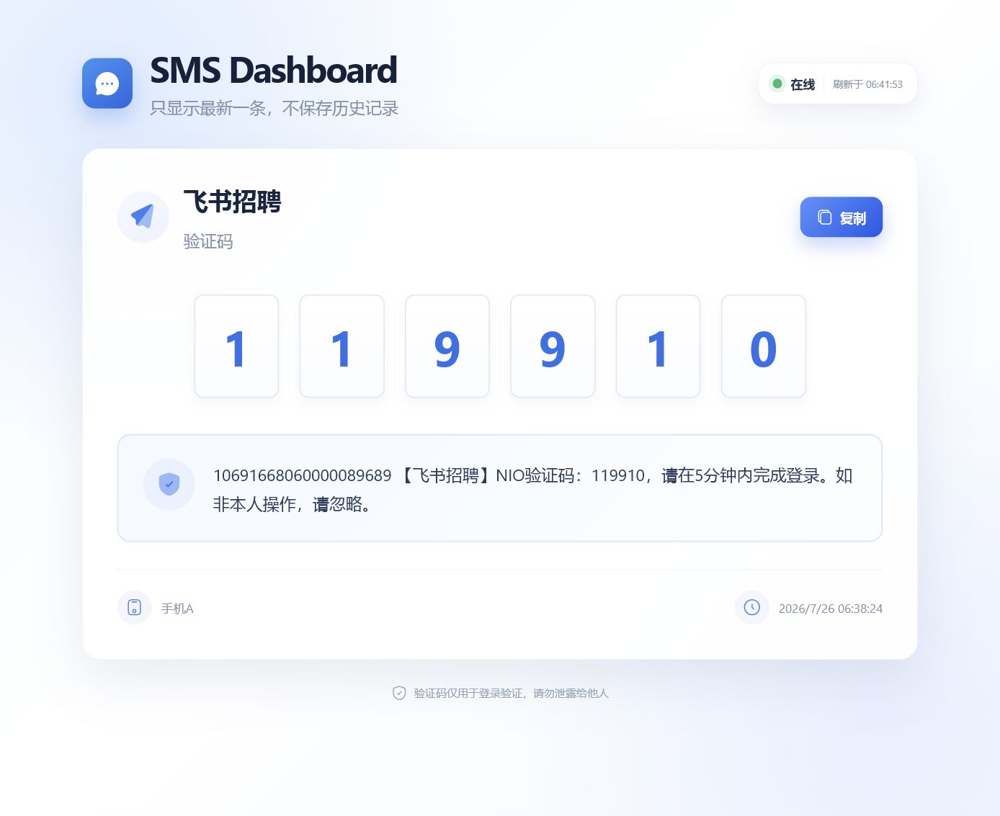

# SMS Dashboard

一个适合个人使用的轻量短信验证码看板：

- Android 手机通过 SmsForwarder Webhook 转发短信
- FastAPI 接收并解析短信发送方和 4～8 位验证码
- 网页每秒自动获取最新短信
- 只在内存中保留最新一条，不使用数据库
- 无登录、无 Token
- 桌面端按 90% 显示，手机端保持正常比例

> 注意：此项目没有任何身份认证。知道网址的人可以查看最新短信，也可以调用接口伪造内容。请只在可信网络中使用，或自行增加访问控制。

## 项目截图



## 项目结构

```text
sms-dashboard-no-auth/
├─ docs/
│  └─ project-screenshot.jpg
├─ index.html
├─ main.py
├─ requirements.txt
├─ start.bat
└─ README.md
```

## 接口说明

| 方法 | 地址 | 用途 |
| --- | --- | --- |
| `GET` | `/` | 打开短信看板 |
| `GET` | `/health` | 检查服务是否运行 |
| `POST` | `/sms` | 接收 SmsForwarder 数据 |
| `GET` | `/latest` | 获取最新一条短信 |

`POST /sms` 请求示例：

```json
{
  "text": "【Google】验证码 123456",
  "device": "手机A"
}
```

## Windows 宝塔部署教程

### 1. 上传项目

下载项目源码并解压到：

```text
C:\wwwroot\sms-dashboard-no-auth
```

### 2. 安装 Python 环境

在宝塔面板中打开：

```text
网站 → Python项目 → Python环境管理
```

安装 Python 3.11。本文示例环境路径为：

```text
C:\BtSoft\python\python_3.11.15\python.exe
```

如果你的 Python 版本或安装目录不同，请同步修改后面的启动命令。

### 3. 安装依赖

可以在创建 Python 项目时，将“安装依赖包”设置为：

```text
C:\wwwroot\sms-dashboard-no-auth\requirements.txt
```

也可以在宝塔终端执行：

```powershell
& "C:\BtSoft\python\python_3.11.15\python.exe" -m pip install -r "C:\wwwroot\sms-dashboard-no-auth\requirements.txt"
```

### 4. 创建 Python 项目

在宝塔面板中点击“添加 Python 项目”，填写：

```text
项目路径：C:\wwwroot\sms-dashboard-no-auth
项目名称：sms-dashboard-no-auth
Python环境：python_3.11.15
启动方式：命令行启动
环境变量：无
```

启动命令：

```text
C:\BtSoft\python\python_3.11.15\python.exe -m uvicorn main:app --host 127.0.0.1 --port 8000 --workers 1
```

项目必须使用单个 Worker，否则不同进程保存的“最新短信”可能不一致。

### 5. 检查服务

项目启动后，在 PowerShell 中执行：

```powershell
Invoke-RestMethod -Uri "http://127.0.0.1:8000/health"
```

正常结果：

```json
{"status":"ok"}
```

### 6. 配置反向代理

在宝塔中新建反向代理网站并绑定自己的域名，例如：

```text
域名：sms.example.com
目标 URL：http://127.0.0.1:8000
发送域名：$host
代理目录：/
```

然后申请并启用 SSL 证书，最终使用：

```text
https://sms.example.com
```

### 7. 配置 SmsForwarder

转发方式选择 `Webhook`：

```text
请求方式：POST
请求地址：https://sms.example.com/sms
Content-Type：application/json
```

请求体：

```json
{
  "text": "[msg]",
  "device": "手机A"
}
```

本项目不需要配置 `Authorization` 请求头。

### 8. 发送测试短信

PowerShell 测试命令：

```powershell
curl.exe -X POST "https://sms.example.com/sms" `
  -H "Content-Type: application/json" `
  --data-raw '{"text":"【Google】验证码 123456","device":"手机A"}'
```

正常返回：

```json
{"ok":true,"code":"123456"}
```

随后打开：

```text
https://sms.example.com/
```

网页应显示刚才发送的短信和验证码。

## 字段说明

- `text`：SmsForwarder 转发的完整短信内容。
- `device`：设备名称，可自行填写，例如“手机A”。
- `SubId`：Android 的 SIM 订阅 ID，用于区分不同 SIM 卡；本项目不会单独处理它。

## 验证码和发送方匹配规则

- 优先从“验证码、校验码、动态码、认证码、verification code、code”后面提取 4～8 位数字。
- 如果没有关键词，则查找短信中的第一组独立 4～8 位数字。
- 优先把 `【发送方】` 或 `[发送方]` 中的文字作为发送方名称。
- 无法识别发送方时显示“短信”，无法识别验证码时显示“未识别”。

## 更新项目

覆盖服务器中的项目文件后，在宝塔 Python 项目页面重启项目即可。

